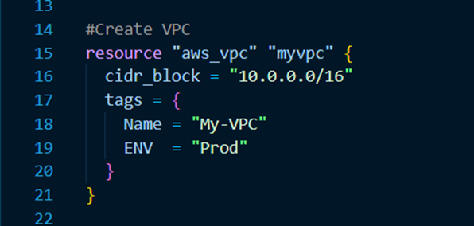
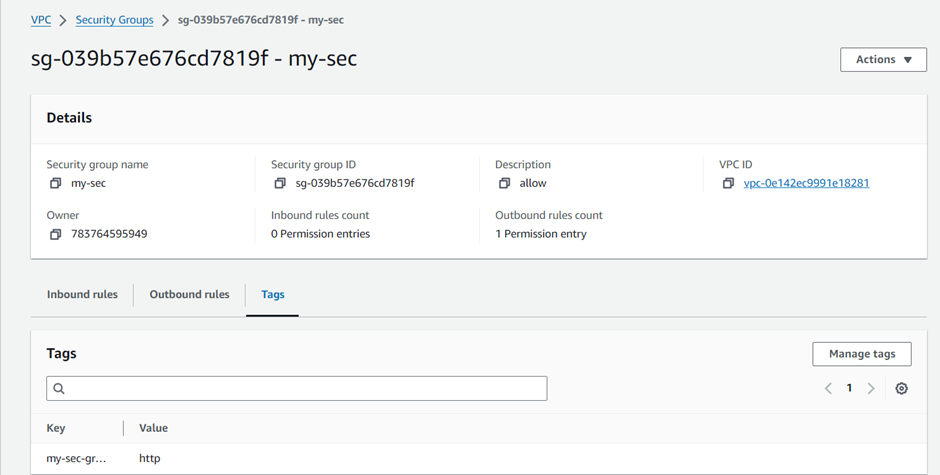

# Creating EC2 Instance using Terraform Datasource

## Creating VPC using Terraform

## Creating Private Subnet

## Creating Security Group on AWS portal

## Creating Datasource for Security Group

## Creating Datasource for Private Subnet

## Building EC2 Instance using Datasource for Private Subnet and Security Group

## EC2 Instance is Created

## Security Group of EC2 Instance

## VPC and Private Subnet of EC2 Instance
