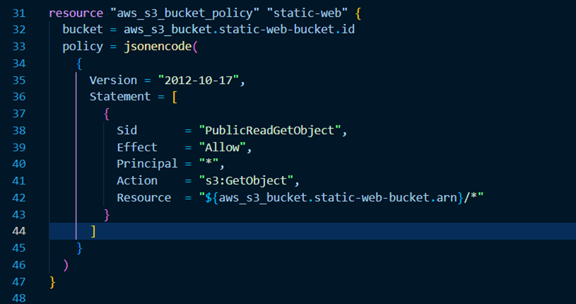

# Automated Static Website Deployment to AWS S3 using Terraform

### This project automates the deployment of a static website to an AWS S3 bucket using Terraform. The process involves creating the S3 bucket, configuring it for public access, enabling static website hosting, and uploading website files. A bucket policy is added to allow public access to the website, with the policy code taken from AWS documentation. Once deployed, the website can be accessed via the provided S3 website endpoints, making the process fully automated and repeatable.
## HTML file for the static website

## CSS file for the static website

## Website running locally 

## Creating S3 bucket on terraform. Using Random provider to generate random ID to the S3 bucket

## These and the provider configuration

## Bucket creation and uploaded files to HTML and CSS files to S3 Bucket

## Configuring Public access

## Adding Bucket policy to S3 bucket to provide permission to view the website

## Website configuration

## Adding website endpoints to get URL in terraform terminal

## S3 Bucket is created.

## S3 Bucket is provisioned in the AWS portal

## The Static Website is now up and running
